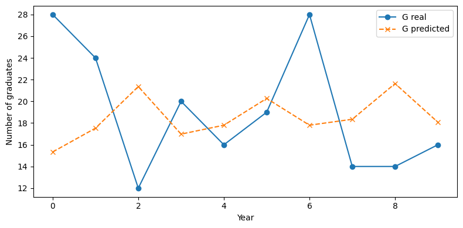
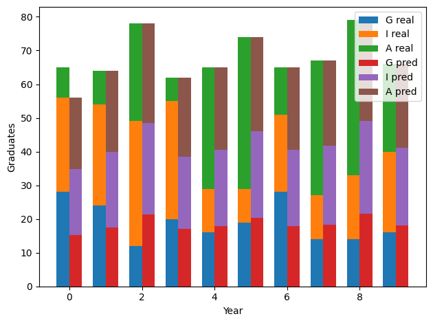
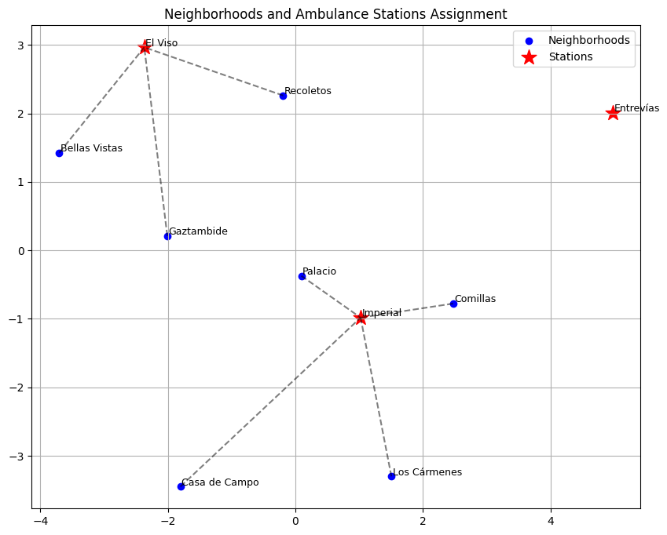

# Optimization and Analytic

This repository contains three notebooks I made for the Optimization and Analytics course, each one covering a different type of optimization problem: linear, non-linear, and discrete.

## Contents

### 1. Linear Programming - Logistics (`LinearProgramming.ipynb`)

In this notebook I resolve a Linear Programming problem: a company must ship products from two warehouses to three retail stores, minimizing transportation cost while fulfilling store demand and not 
exceeding warehouse supply. I solved it using the `pulp` library.

**Result:** minimum total cost of 950€. Store 1 is supplied entirely from warehouse 1, while stores 2 and 3 receive their products from warehouse 2, using only the most economical routes.

I wanted to include a graph to better visualize the results, but I wasn't able because of some technical problems with the plotting tools. However, the numerical results already make the solution 
very clear and easy to understand.

### 2. Non-Linear Programming - Constrained Regression (`NonLinear_Programming.ipynb`)

A university wants to assess the job placements of its graduates between government, industry, and academic positions. I modeled this as a constrained regression problem and solved it with 
`scipy.optimize.minimize`.



The line graph compares the actual placement of graduates in government with the model's prediction, and shows that the model is too simplistic to capture reality: the actual line is highly volatile, 
while the predicted line is much smoother since the model assumes an optimized constant ratio.



The stacked bar chart shows the model accurately predicts the total number of graduates each year, but fails to predict the internal distribution between sectors in specific years.

### 3. Discrete Model - Facility Location (`DiscreteModel.ipynb`)

A city wants to place 3 ambulance stations to serve 10 neighborhoods, assigning each neighborhood to one station while minimizing total response distance. I first tried the `discrete_optimization` 
library but ran into errors, so I switched to `ortools` (using the SCIP solver), and used the Haversine formula to calculate real distances between neighborhoods from their GPS coordinates.



The plot represents neighborhoods and ambulance stations using their spatial coordinates (via MDS (Multidimensional Scaling)), with dotted lines showing the assignment of each neighborhood to its nearest station.

## Libraries

- Python
- Numpy
- Pandas
- SciPy
- PuLP
- OR-Tools
- Matplotlib
- Scikit-learn

## How to run

```bash
git clone https://github.com/MartaSantome/Optimization-and-Analytics.git
cd Optimization-and-Analytics
pip install numpy pandas scipy pulp ortools matplotlib scikit-learn jupyter
jupyter notebook
```

Each notebook is self-contained and can be run independently.
